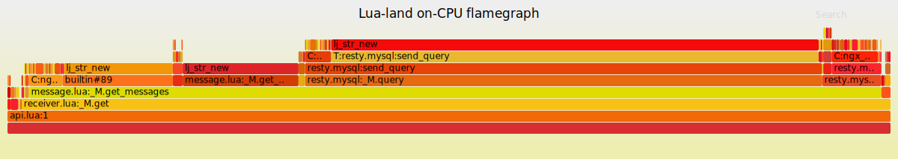
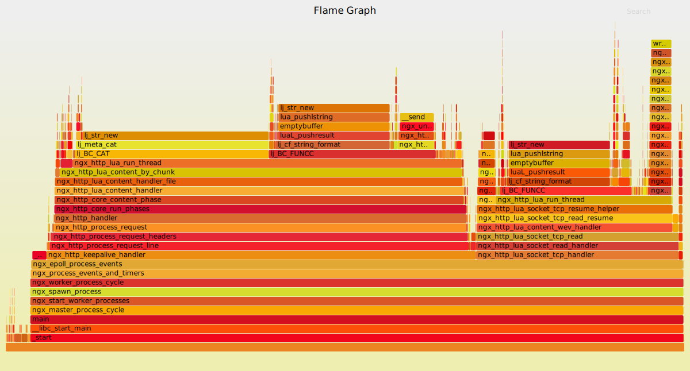
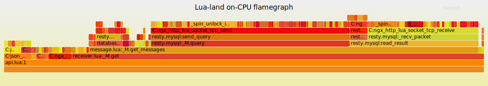
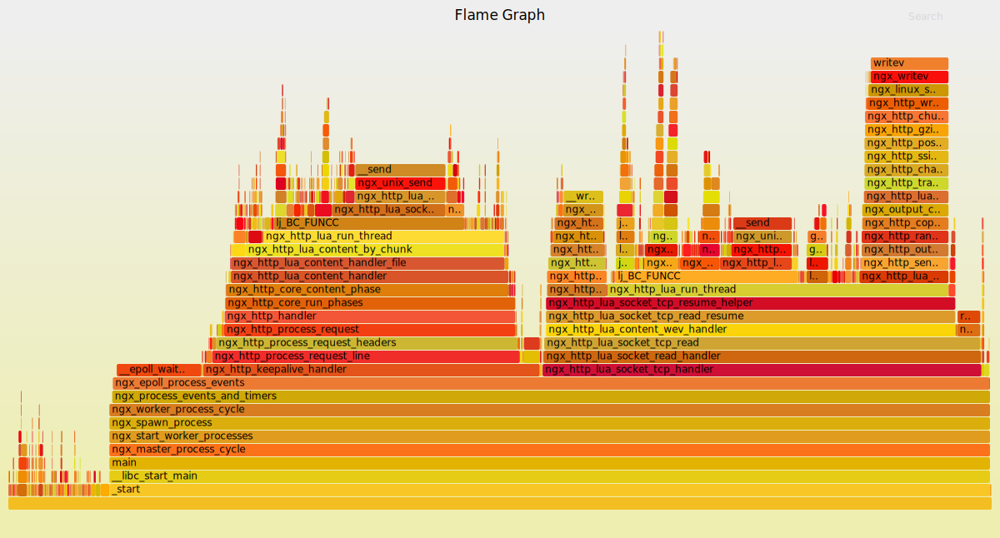
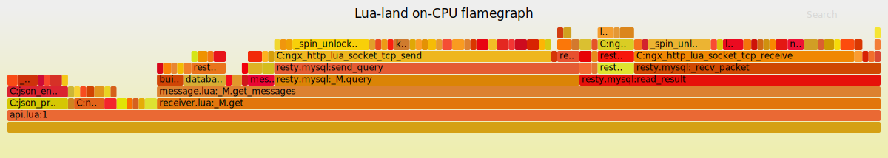

# Benchmark

benchmark is conducted by the modern http benchmark tool wrk which supports lua script. The script used in this benchmark needs cjson so copy it into this directory.

```
cp ../deps/lua-cjson/cjson.so ./
```

## post

post.lua
```lua
local cjson_safe = require "cjson.safe"

wrk.method="POST"
data = {}
data['sender'] = 'sender1'
data['messages'] = {queue1={"hello world"}}
wrk.body = cjson_safe.encode(data)
```

### goal
The best outcome of write into mysql in lua-nginx is like this:
```nginx
location /test_mysql {
    content_by_lua_block {
      # copy the lua code from below
    }
}
```

```lua
local mysql = require "resty.mysql"

local  data = ngx.req.get_body_data()
if data == nil then
    ngx.exit(ngx.HTTP_INTERNAL_SERVER_ERROR)
end

local db, err = mysql:new()
if not db then
    ngx.say("failed to instantiate mysql: ", err)
    ngx.exit(ngx.HTTP_INTERNAL_SERVER_ERROR)
end

db:set_timeout(1000) -- 1 sec

local ok, err, errcode, sqlstate = db:connect{
    host = "127.0.0.1",
    port = 3306,
    database = "nq_test",
    user = "nq",
    password = "123456",
    charset = "utf8"}

if not ok then
    ngx.say("failed to connect: ", err, ": ", errcode, " ", sqlstate)
    ngx.exit(ngx.HTTP_INTERNAL_SERVER_ERROR)
end

res, err, errcode, sqlstate =
    db:query(string.format("insert into test(msg) values('%s')", data))
if not res then
    ngx.say("bad result: ", err, ": ", errcode, ": ", sqlstate, ".")
    ngx.exit(ngx.HTTP_INTERNAL_SERVER_ERROR)
end

-- local cjson = require "cjson"
-- ngx.say("result: ", cjson.encode(res))


-- put it into the connection pool of size 100,
-- with 10 seconds max idle timeout
local ok, err = db:set_keepalive(10000, 100)
if not ok then
    ngx.say("failed to set keepalive: ", err)
    ngx.exit(ngx.HTTP_INTERNAL_SERVER_ERROR)
end
ngx.say("done.")

```

```
> wrk -c 1 -d 5 -t 1 -s post.lua http://localhost:8001/test_mysql
Running 5s test @ http://localhost:8001/test_mysql
  1 threads and 1 connections
  Thread Stats   Avg      Stdev     Max   +/- Stdev
    Latency   125.24us   19.93us   1.29ms   84.94%
    Req/Sec     7.89k   809.83     8.76k    76.47%
  40074 requests in 5.10s, 6.80MB read
Requests/sec:   7858.04
Transfer/sec:      1.33MB
```

### 1 connection
```
> wrk -c 1 -d 5 -t 1 -s post.lua http://localhost:8001/post
Running 5s test @ http://localhost:8001/post
  1 threads and 1 connections
  Thread Stats   Avg      Stdev     Max   +/- Stdev
    Latency   247.46us  450.92us  11.93ms   98.48%
    Req/Sec     4.82k   492.12     5.44k    82.35%
  24448 requests in 5.10s, 4.45MB read
Requests/sec:   4794.14
Transfer/sec:      0.87MB
```

### 10 connections
```
> wrk -c 10 -d 30 -t 1 -s post.lua http://localhost:8001/post
Running 30s test @ http://localhost:8001/post
  1 threads and 10 connections
  Thread Stats   Avg      Stdev     Max   +/- Stdev
    Latency     1.62ms    2.81ms  54.22ms   96.83%
    Req/Sec     8.11k     1.99k   10.52k    65.00%
  241977 requests in 30.00s, 44.28MB read
Requests/sec:   8065.85
Transfer/sec:      1.48MB
```


## pull

### one subscriber
pull.lua
```lua
local cjson_safe = require "cjson.safe"

wrk.method="POST"
data = {}
data['receiver'] = 'receiver1'
data['queues'] = {queue1={}}
wrk.body = cjson_safe.encode(data)
```

#### 1 connection
```
> wrk -c 1 -d 5 -t 1 -s pull.lua http://localhost:8001/pull
Running 5s test @ http://localhost:8001/pull
  1 threads and 1 connections
  Thread Stats   Avg      Stdev     Max   +/- Stdev
    Latency     1.05ms    1.32ms  25.32ms   98.84%
    Req/Sec     1.07k   106.20     1.25k    76.47%
  5432 requests in 5.10s, 1.52MB read
Requests/sec:   1065.11
Transfer/sec:    305.54KB
```
It's much slower than expected. Something must be wrong.

##### flame graph
Follow steps in [openresty/stapxx#lj-lua-stacks](https://github.com/openresty/stapxx#lj-lua-stacks) and [agentzh/nginx-systemtap-toolkit#sample-bt](https://github.com/agentzh/nginx-systemtap-toolkit#sample-bt) to generate lua land flame graph and c land flame graph seperately.

install tools
```
git clone https://github.com/openresty/stapxx.git
export PATH=$PWD/stapxx:$PATH
export PATH=$PWD/stapxx/samples:$PATH

git clone https://github.com/openresty/openresty-systemtap-toolkit.git
export PATH=$PWD/openresty-systemtap-toolkit:$PATH

git clone https://github.com/brendangregg/FlameGraph.git
export PATH=$PWD/FlameGraph:$PATH

cd stapxx
```

###### lua land
create `lua_fg.sh`
```sh
lj-lua-stacks.sxx --arg time=5 --skip-badvars -x $(pgrep -P $(pgrep -f '/opt/nginx/sbin/nginx -p /opt/nq')) > a.bt
fix-lua-bt a.bt > a2.bt
stackcollapse-stap.pl a2.bt > a.cbt
flamegraph.pl --encoding="ISO-8859-1" \
              --title="Lua-land on-CPU flamegraph" \
              a.cbt > a.svg
```

execute
```
wrk -c 1 -d 15 -t 1 -s pull.lua http://localhost:8001/pull &
./lua_fg.sh
```



###### c land
let's have a look at the c land flame graph
create c_fg.sh
```
sample-bt -p $(pgrep -P $(pgrep -f '/opt/nginx/sbin/nginx -p /opt/nq')) -u -t 5 > a.bt
stackcollapse-stap.pl a.bt > a.cbt
flamegraph.pl a.cbt > a.svg
```

```
wrk -c 1 -d 15 -t 1 -s pull.lua http://localhost:8001/pull &
./c_fg.sh
```



Both graphs say `lj_str_new` consumes too much time(even more than mysql query) in `message.lua:_M.get_messages` function. 

The main role of get_messages is:

1. construct sql statements by using `string.format` and `table.concat`
2. send query where resty.mysql use `..` constructs the packet before send to mysql server

`string.format`, `..` operator and `table.concat` all call `lj_str_new`. It seems the reason for the performance problem is that lj_str_new is too slow.

After looking up the source code of lj_str_new in lj_str.c, I find it use a mechanism to save memory(for else?) by saving the same string only once in a hash table:

1. compute the hash(a 32bit int) of a string
2. look up it in a global hash table. If the same string already exists, return the interned string.

**If a lot of similar strings are created, the process of looking up degenerates into linear search in the same bucket because the hash algorithm only samples a few bytes in the string.** A simple benchmark from [here](test_ljstr_hash.c) can prove this.

The similar question is proposed in openresty's google group 
[luajit在处理某些字符串场景时出现性能问题](https://groups.google.com/forum/#!msg/openresty/guVFrMTVD8U/0-tbM7BCAQAJ).
They solved it by not concatting/formatting string in lua land. Instead, pass an array to lua-nginx's sock:send method. But it doesn't solve the problem fundamentally.

Another way is to change the hash algorithm or don't intern long strings at all. It's also discussed here
[Github: Reduce string hash collisions](https://github.com/LuaJIT/LuaJIT/issues/168) a year ago. It's a sad news that the author of laujit has not taken action on this issue.

Finally, I solved it by passing a table of string fragments to cosocket. See [feature: support pass table to send_query](https://github.com/openresty/lua-resty-mysql/pull/68).

After optimisization the performance improves 50%.
```
> wrk -c 1 -d 5 -t 1 -s pull.lua http://localhost:8001/pull
Running 5s test @ http://localhost:8001/pull
  1 threads and 1 connections
  Thread Stats   Avg      Stdev     Max   +/- Stdev
    Latency   754.37us    1.56ms  33.70ms   99.22%
    Req/Sec     1.55k   183.02     2.22k    86.27%
  7864 requests in 5.10s, 2.20MB read
Requests/sec:   1542.04
Transfer/sec:    442.45KB
```
The flame graph shows that ls_new_str is no longer the bottleleck:




**updated on 2017.11.11**
Fortunately, openresty's own branch of luajit has reduced the hash collision in lua string table.

Finally, I decided to turn to the newest openresty because it has significantly optimized the string creation.
The lua land flame graph is close to above.



#### 10 connections
imitate distributed jobs

```
> wrk -c 10 -d 5 -t 1 -s pull.lua http://localhost:8001/pull
Running 5s test @ http://localhost:8001/pull
  1 threads and 10 connections
  Thread Stats   Avg      Stdev     Max   +/- Stdev
    Latency     6.45ms    1.30ms  31.16ms   97.56%
    Req/Sec     1.57k   128.49     1.80k    68.63%
  7948 requests in 5.10s, 2.23MB read
Requests/sec:   1558.29
Transfer/sec:    448.43KB
```

### many subscribers
imitate pub/sub or brodcast pattern

#### 1 connection
many subscribers get the same messages in 1 connection.

pull2.lua
```lua
local cjson_safe = require "cjson.safe"

data = {}
data['queues'] = {queue1={max=5}}
i = 1
request = function()
    data['receiver'] = 'receiver'..i
    body = cjson_safe.encode(data)
    i = i + 1
    return wrk.format("POST", nil, nil, body)
end
```

```
> wrk -c 1 -d 5 -t 1 -s pull2.lua http://localhost:8001/pull
Running 5s test @ http://localhost:8001/pull
  1 threads and 1 connections
  Thread Stats   Avg      Stdev     Max   +/- Stdev
    Latency     1.09ms    1.21ms  27.06ms   99.21%
    Req/Sec     0.96k    53.49     1.05k    92.00%
  4772 requests in 5.00s, 3.05MB read
Requests/sec:    954.18
Transfer/sec:    623.79KB
```
It's still too slow although messages are retrieved from cache because:

1. request body is generated by lua_cjson for every request
2. lua-nginx load the request body to lua string(hash conflict)


#### N connections
every subscriber listen a queue in a connection

see [test_concurrent.py](test_concurrent.py)

you may need increase the number of open files:
```sh
ulimit -n 2048
```

If you encounter error `mySQL Error 1040: Too Many Connection` please increase the max_connections of mysql:
```mysql
mysql> SET GLOBAL max_connections = 1024;
```
